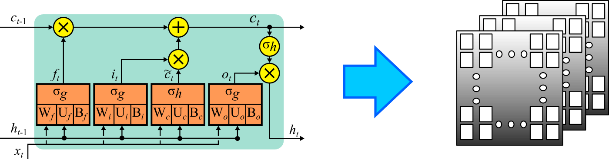

# PART-MLC
Programming Architecture for Real-Time Machine Learning Control 

## [Time Series Forecasting](Time_Series_Forecasting)
High-rate time series forecasting.

## [State Estimation](State_Estimation)
High-rate state estimation.

## [Metrics](Metrics)
High-rate state estimation.

## [Organizational](Organizational)
Back-end products

