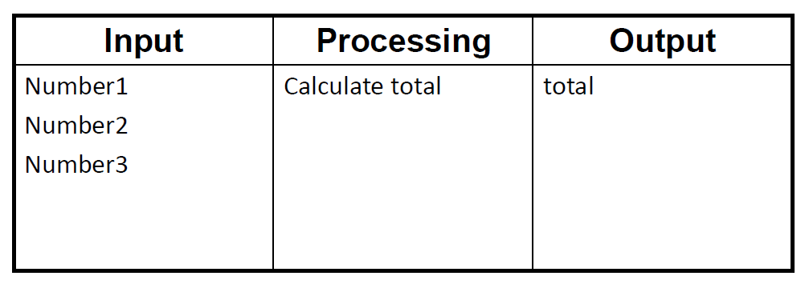

# FFT-based Time Series Forecasting
## Python Function
## How to run:
There are two script of python
1. main.py which is for user. Data input and tuning the configuration and plot the output by this one.
2. model.py this is the FFT based prediction function.
3. For user just need to runn the main.py

## Matlab

## LabVIEW

## Vivado

