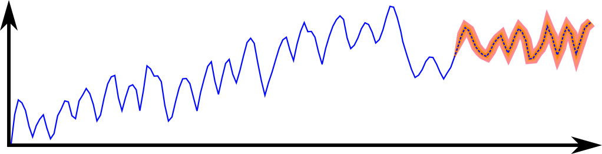

 # Online RNN

High-rate time series forecasting with online learning. 

## xxx
1. Code is located in src directory. All needed calls available through main.py

main.py mostly relies on its CLI. There exists a 'zero-arguments' version but this is less customizable.
main.py also uses config files for most of its auxiliary information
An example config may be included in the future.

